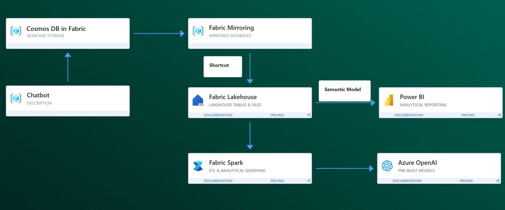

# fabric-cosmosdb-chat-analytics
FabCon Reactor Hackathon: Demo material and Fabric notebooks for analyzing chat history stored in Cosmos DB in Fabric

## Prerequisites

You need the following services to run this notebook.

- [Microsoft Fabric](https://aka.ms/fabric/getting-started) with 64 capacity
- [Cosmos DB in Fabric artifact](https://learn.microsoft.com/fabric/database/cosmos-db/quickstart-portal)

You also need to upload chat_history and product catalog information to a Cosmos DB NoSQL database as separate containers. 
- dataset: a sample dataset is provided in the chat_history_data directory. The sample dataset is syntethically generated using gpt-4 mimicking user-chatbot interactions with an e-commercy company. 
- For Cosmos DB mirroring, please follow the [documentation](https://learn.microsoft.com/fabric/database/cosmos-db/mirror-onelake). Note, for Cosmos DB in Fabric artifacts, mirroring is automatically enabled, so no configuration is needed.
- For creating a shortcut of mirrored database, please follow the [documentation](https://learn.microsoft.com/fabric/database/cosmos-db/how-to-access-data-lakehouse).

## Extracting insights

### Goal: extract product feedback from chat history data. 

### Solution architecture

### Steps
1) Create a Cosmos DB in Fabric artifact and upload sample data in their respective containers

2) Mirror chat history and product catalog data in Fabric OneLake. 
The data for product catalog is found in product_catalog directory and a sample data for chat_history data can be found in chat_history_data directory. Please use the chathistory_all.json. 

3) Create Shortcuts of chat history and product catalog into the Lakehouse

4) Upload and run the analyis Notebook
Navigate to the analysis_notebook directory.
Open the main_demo notebook and attach the lakehouse and run the notebook.
bonus: you may run the RAG notebbook to vectorize chat history and ask ad-hoc questions.

5) Use semantic modeling and powerbi copilot to create a dashboard
Make sure PowerBI Q&A setting is enabled. Go to Fabric settings > PowerBI Settings > Semantic Models > Select Semantic Model > Q&A
